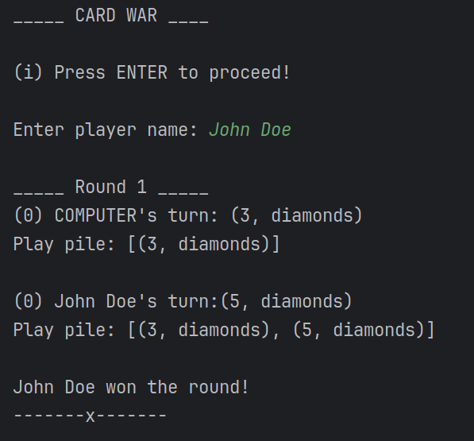
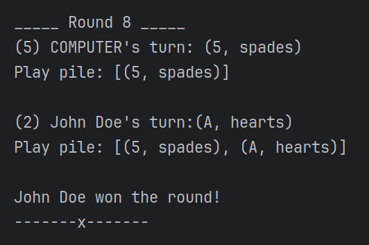
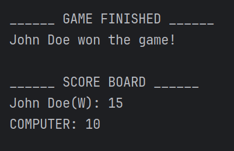

# Card Game using JAVA

## Introduction

This is a card game made using JAVA. It is actually a CLI application.

## Game Rules

There will be 2 players. Both can press enter and a card will automatically be placed on the arena.
The player with greater rank card will win the round. After 26 rounds the player having the maximum 
score will win the game.

## How to play

- Run the application 
- Click ENTER to proceed
- Enter player name
- Keep pressing ENTER 
- The CLI will guide you

## Screenshots

## Game design

This game is designed with basic java code. 

### User defined Classes

#### Player

Class defined for managing a player entity.

#### Card

Class used to manage all the 52 cards.

### Rank to number mapping

A hashmap is used to map the ranks of the cards to the number of the cards

